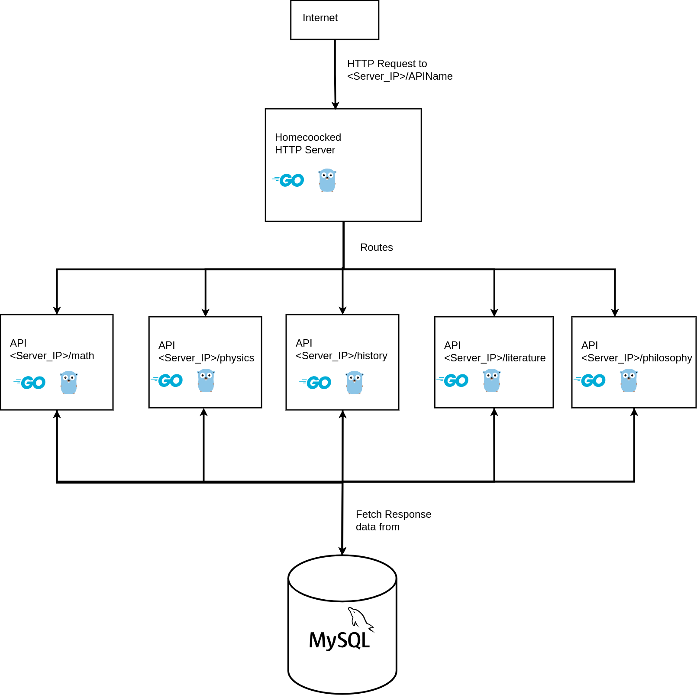

# Homecooked_HTTP
Building HTTP server from scratch with raw sockets for learning purposes. The server routes requests that returns random facts about mathematics, physics, literature, history, and philosophy.

No AI tools/copy-pasting.

## Architecture

